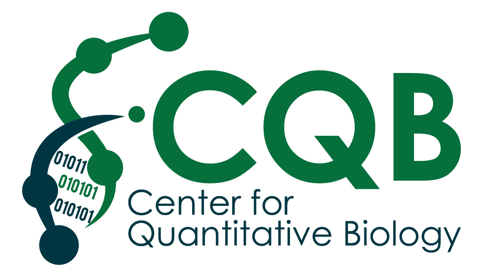

## RNA-seq data analysis workshop, June 2023

This workshop will be delivered on June 12-16 (12-5pm) by the Genomic Data Sciences Core (GDSC) of the [Center for Quantitative Biology at Dartmouth](https://sites.dartmouth.edu/cqb/).

The GDSC aims to facilitate advanced bioinformatic, computational, and statistical analysis of complex genomics data for the Dartmouth research community.

If you have questions about this workshop, or would like to discuss data analysis services available from the Genomic data sciences core, please visit our [website](https://sites.dartmouth.edu/cqb/projects-and-cores/data-analytics-core/), or email us at: DataAnalyticsCore@groups.dartmouth.edu

### Workshop goals:
- Develop a working understanding of the analytical workflow for a modern bulk RNA-seq experiment
- Build a working knowledge of sample preparation considerations for RNA-seq experiments
- Learn how to process raw NGS data in FASTQ format to generate a gene expression matrix
- Learn how to perform a detailed quality control analysis
- Understand the basic principles of a differential expression analysis using RNA-seq data
- Develop a working understanding of the fundamental statistics behind a typical differential expression analysis using R/Bioconductor packages
- Perform a differential expression analysis using R/Bioconductor packages
- Learn how to explore the results and make robust insights from your data

### Workshop Contacts:
- Shannon Soucy (Shannon.Soucy@Dartmouth.edu)
- Noelle Kosarek (Noelle.N.Kosarek.GR@Dartmouth.edu)
- Tim Sullivan (Timothy.J.Sullivan@dartmouth.edu)
- Owen Wilkins (omw@Dartmouth.edu)
